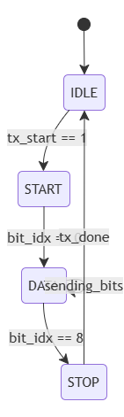
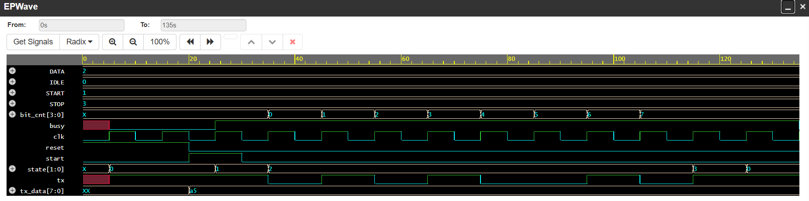
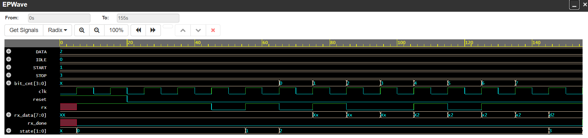

# UART-Controller-using-verilog
A synthesizable UART controller design # UART Controller (RTL Design)

## Description
This project implements a Universal Asynchronous Receiver-Transmitter (UART) controller using Verilog HDL. It supports standard serial communication with a configurable baud rate. This design follows a Finite State Machine (FSM) approach to manage data transmission and reception.

## Features
- Full-duplex asynchronous communication.
- Supports 8-bit data transmission/reception.
- Implemented using FSM (Finite State Machine).
- Synthesizable RTL design.

## Files
- `uart_tx.v`: Transmitter module.
- `uart_rx.v`: Receiver module.
- `uart_tb.v`: Testbench to verify UART communication.

## Verification Strategy
- Simulated using Icarus Verilog and viewed in GTKWave.
- Tested using a loopback mechanism to verify integrity of transmitted and received data.
- Automated testing performed using Python scripts to interface with hardware.

## How to run
1. Clone the repository.
2. Compile the RTL and testbench: `iverilog -o sim uart_tx.v uart_rx.v uart_tb.v`
3. Run the simulation: `vvp sim`
4. Open the `.vcd` file in GTKWave to observe the signals.
## FSM State Diagram

## Simulation Waveform

## Hardware Integration
- This design was verified using an ESP32 as a serial bridge (via CH340) for real-time data communication testing.in Verilog, including TX/RX modules and an automated testbench for serial communication verification
